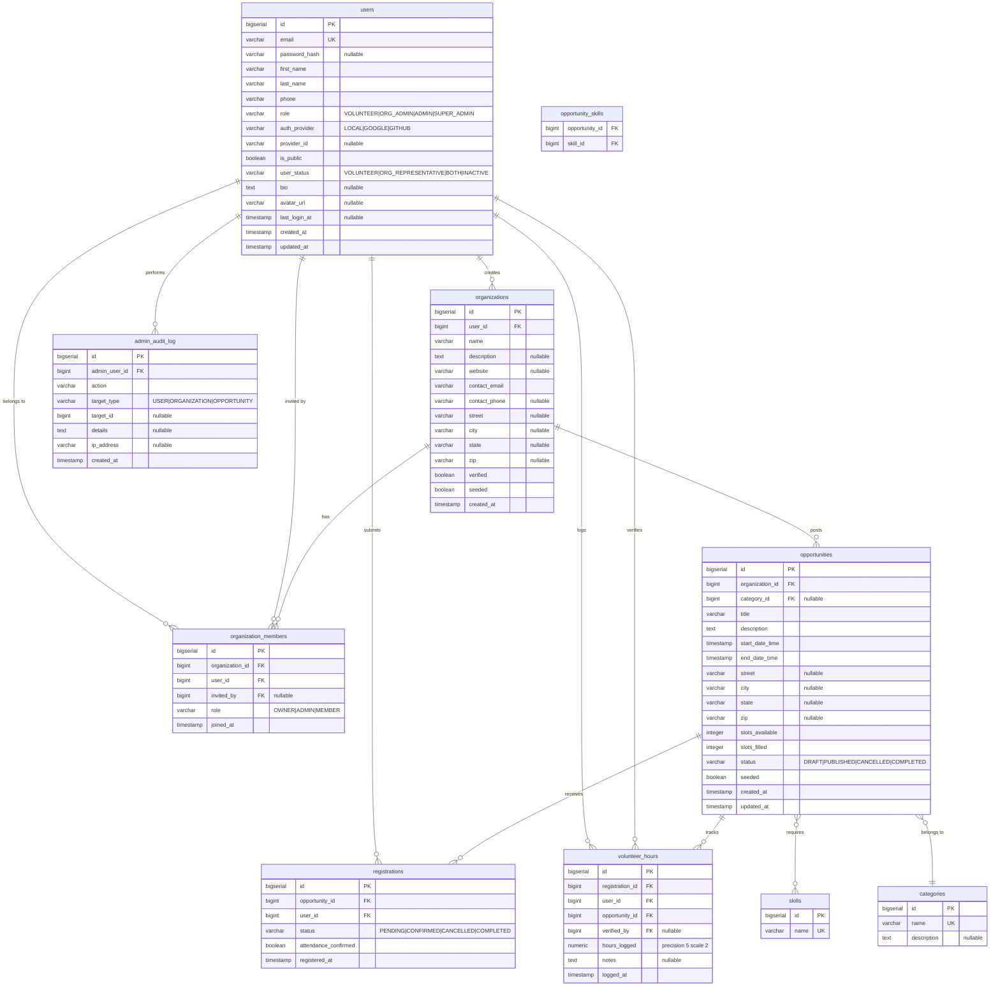
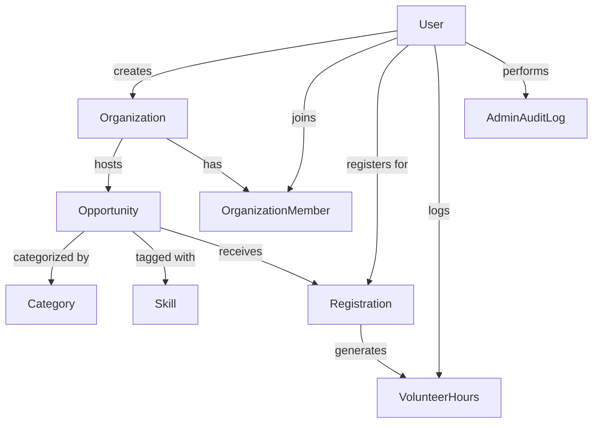
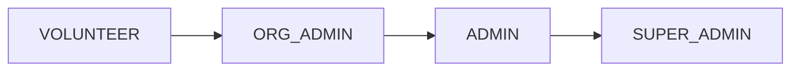
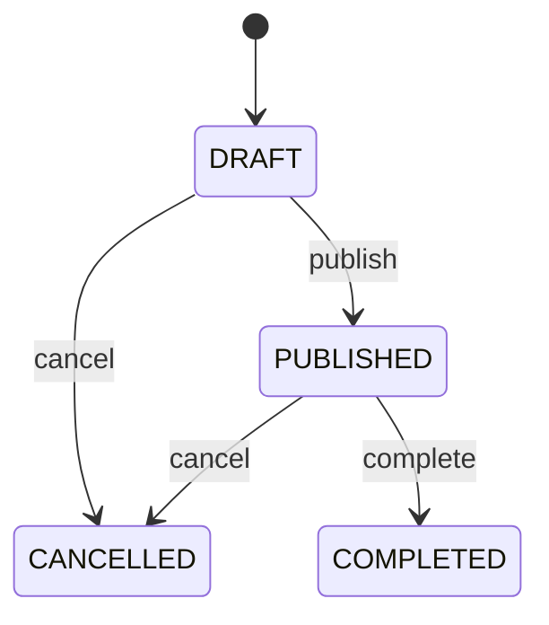
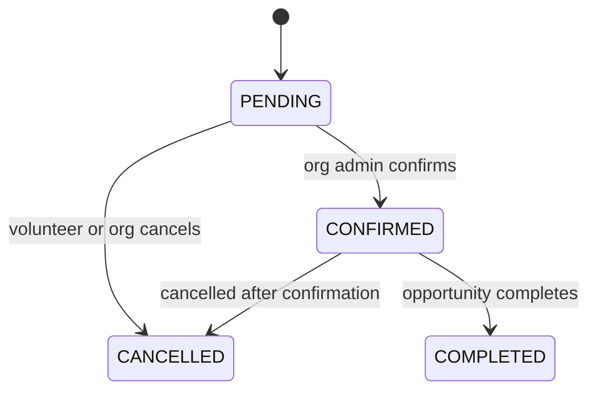

# Tampa Volunteers — Data Model

This document describes the database schema and entity relationships for the Tampa Volunteers platform.

## Table of Contents

- [Entity Relationship Diagram](#entity-relationship-diagram)
- [Entities](#entities)
  - [User](#user)
  - [Organization](#organization)
  - [OrganizationMember](#organizationmember)
  - [Opportunity](#opportunity)
  - [Category](#category)
  - [Skill](#skill)
  - [Registration](#registration)
  - [VolunteerHours](#volunteerhours)
  - [AdminAuditLog](#adminauditlog)
- [Enumerations](#enumerations)
- [Schema History](#schema-history)

---

## Entity Relationship Diagram

---

## Aggregated Relationship Overview

---

## Entities

### User

Central entity representing any person interacting with the platform. Supports both local password-based auth and OAuth via Google or GitHub.

| Column | Type | Constraints | Notes |
|--------|------|-------------|-------|
| `id` | `bigserial` | PK | |
| `email` | `varchar(255)` | NOT NULL, UNIQUE | |
| `password_hash` | `varchar(255)` | nullable | NULL for OAuth users |
| `first_name` | `varchar(100)` | NOT NULL | |
| `last_name` | `varchar(100)` | NOT NULL | |
| `phone` | `varchar(20)` | nullable | |
| `role` | `varchar(20)` | NOT NULL | See [UserRole](#userrole) |
| `auth_provider` | `varchar(20)` | NOT NULL, DEFAULT `LOCAL` | See [AuthProvider](#authprovider) |
| `provider_id` | `varchar(255)` | nullable | OAuth subject identifier |
| `is_public` | `boolean` | NOT NULL, DEFAULT `false` | Controls profile discoverability |
| `user_status` | `varchar(50)` | NOT NULL, DEFAULT `VOLUNTEER` | See [UserStatus](#userstatus) |
| `bio` | `text` | nullable | |
| `avatar_url` | `varchar(500)` | nullable | |
| `last_login_at` | `timestamp` | nullable | |
| `created_at` | `timestamp` | NOT NULL, immutable | |
| `updated_at` | `timestamp` | NOT NULL | |

**Indexes:** `email`, `role`, `auth_provider`, `provider_id`, `is_public`, `user_status`, `last_login_at`

**Unique Constraint:** `(provider_id, auth_provider)` where both are non-null — prevents duplicate OAuth accounts.

---

### Organization

A nonprofit or community group that posts volunteer opportunities. Created by a User (the initial owner).

| Column | Type | Constraints | Notes |
|--------|------|-------------|-------|
| `id` | `bigserial` | PK | |
| `user_id` | `bigint` | FK → users, NOT NULL | Creator / initial owner |
| `name` | `varchar(255)` | NOT NULL | |
| `description` | `text` | nullable | |
| `website` | `varchar(255)` | nullable | |
| `contact_email` | `varchar(255)` | NOT NULL | |
| `contact_phone` | `varchar(20)` | nullable | |
| `street` | `varchar(255)` | nullable | |
| `city` | `varchar(100)` | nullable | |
| `state` | `varchar(2)` | nullable | |
| `zip` | `varchar(10)` | nullable | |
| `verified` | `boolean` | NOT NULL, DEFAULT `false` | Set by ADMIN/SUPER_ADMIN |
| `seeded` | `boolean` | NOT NULL, DEFAULT `false` | Marks dev seed data |
| `created_at` | `timestamp` | NOT NULL, immutable | |

**Indexes:** `user_id`, `verified`

---

### OrganizationMember

Join table with metadata for the many-to-many relationship between Users and Organizations. Supports multi-admin organizations with role-based access inside an org.

| Column | Type | Constraints | Notes |
|--------|------|-------------|-------|
| `id` | `bigserial` | PK | |
| `organization_id` | `bigint` | FK → organizations, NOT NULL | |
| `user_id` | `bigint` | FK → users, NOT NULL | |
| `role` | `varchar(50)` | NOT NULL, DEFAULT `MEMBER` | See [OrgMemberRole](#orgmemberrole) |
| `joined_at` | `timestamp` | NOT NULL, DEFAULT NOW | |
| `invited_by` | `bigint` | FK → users, nullable | The member who sent the invitation |

**Unique Constraint:** `(organization_id, user_id)` — a user can only be a member once.

**Indexes:** `organization_id`, `user_id`, `role`

---

### Opportunity

A specific volunteer event or recurring role posted by an Organization.

| Column | Type | Constraints | Notes |
|--------|------|-------------|-------|
| `id` | `bigserial` | PK | |
| `organization_id` | `bigint` | FK → organizations, NOT NULL | |
| `category_id` | `bigint` | FK → categories, nullable | |
| `title` | `varchar(255)` | NOT NULL | |
| `description` | `text` | NOT NULL | |
| `start_date_time` | `timestamp` | NOT NULL | |
| `end_date_time` | `timestamp` | NOT NULL | |
| `street` | `varchar(255)` | nullable | |
| `city` | `varchar(100)` | nullable | |
| `state` | `varchar(2)` | nullable | |
| `zip` | `varchar(10)` | nullable | |
| `slots_available` | `integer` | NOT NULL | |
| `slots_filled` | `integer` | NOT NULL, DEFAULT `0` | Maintained by service layer |
| `status` | `varchar(20)` | NOT NULL | See [OpportunityStatus](#opportunitystatus) |
| `seeded` | `boolean` | NOT NULL, DEFAULT `false` | Marks dev seed data |
| `created_at` | `timestamp` | NOT NULL, immutable | |
| `updated_at` | `timestamp` | NOT NULL | |

**Indexes:** `organization_id`, `start_date_time`, `category_id`, `status`

**Relationships:**
- `opportunity_skills` — join table linking Opportunity ↔ Skill (many-to-many)

---

### Category

A top-level classification for Opportunities. Seeded at startup; not user-created.

| Column | Type | Constraints |
|--------|------|-------------|
| `id` | `bigserial` | PK |
| `name` | `varchar(100)` | NOT NULL, UNIQUE |
| `description` | `text` | nullable |

**Seeded values:** Environment, Education, Health, Animals, Community, Food & Hunger, Children & Youth, Seniors, Arts & Culture, Sports & Recreation

---

### Skill

A capability tag that can be attached to Opportunities to help volunteers filter by their strengths. Seeded at startup.

| Column | Type | Constraints |
|--------|------|-------------|
| `id` | `bigserial` | PK |
| `name` | `varchar(100)` | NOT NULL, UNIQUE |

**Seeded values:** Teaching, Construction, Medical, Event Planning, Marketing, Fundraising, Graphic Design, Photography, Web Development, Writing, Public Speaking, Carpentry, Gardening, Cooking, Animal Care, First Aid, Translation, Mentoring, Data Entry, Administration

**Join table:** `opportunity_skills(opportunity_id, skill_id)`

---

### Registration

Records a volunteer signing up for an Opportunity. Enforces one registration per user per opportunity.

| Column | Type | Constraints | Notes |
|--------|------|-------------|-------|
| `id` | `bigserial` | PK | |
| `opportunity_id` | `bigint` | FK → opportunities, NOT NULL | |
| `user_id` | `bigint` | FK → users, NOT NULL | The volunteer |
| `status` | `varchar(20)` | NOT NULL | See [RegistrationStatus](#registrationstatus) |
| `attendance_confirmed` | `boolean` | NOT NULL, DEFAULT `false` | Set by org admin after the event |
| `registered_at` | `timestamp` | NOT NULL, immutable | |

**Unique Constraint:** `(opportunity_id, user_id)` — no duplicate registrations.

**Indexes:** `opportunity_id`, `user_id`, `status`

---

### VolunteerHours

Tracks hours a volunteer contributed for a specific Registration/Opportunity. Supports optional verification by an admin or org admin.

| Column | Type | Constraints | Notes |
|--------|------|-------------|-------|
| `id` | `bigserial` | PK | |
| `registration_id` | `bigint` | FK → registrations, NOT NULL | |
| `user_id` | `bigint` | FK → users, NOT NULL | The volunteer |
| `opportunity_id` | `bigint` | FK → opportunities, NOT NULL | Denormalized for query convenience |
| `verified_by` | `bigint` | FK → users, nullable | Admin who verified the hours |
| `hours_logged` | `numeric(5,2)` | NOT NULL | |
| `notes` | `text` | nullable | |
| `logged_at` | `timestamp` | NOT NULL, immutable | |

**Indexes:** `user_id`, `opportunity_id`, `registration_id`

---

### AdminAuditLog

Append-only log of actions performed by admins and super admins. Supports IPv6 addresses in `ip_address`.

| Column | Type | Constraints | Notes |
|--------|------|-------------|-------|
| `id` | `bigserial` | PK | |
| `admin_user_id` | `bigint` | FK → users, NOT NULL | Actor |
| `action` | `varchar(100)` | NOT NULL | e.g. `ROLE_CHANGE`, `VERIFY_ORG` |
| `target_type` | `varchar(50)` | NOT NULL | `USER`, `ORGANIZATION`, `OPPORTUNITY` |
| `target_id` | `bigint` | nullable | ID of affected resource |
| `details` | `text` | nullable | Free-form context |
| `ip_address` | `varchar(45)` | nullable | |
| `created_at` | `timestamp` | NOT NULL, immutable | |

**Indexes:** `admin_user_id`, `action`, `(target_type, target_id)`, `created_at`

---

## Enumerations

### UserRole

Controls platform-wide access level. Stored as `varchar` in the `users` table.

| Value | Description |
|-------|-------------|
| `VOLUNTEER` | Default role. Can browse and register for opportunities. |
| `ORG_ADMIN` | Can create and manage organizations and their opportunities. |
| `ADMIN` | Platform moderator. Can verify orgs, manage users. |
| `SUPER_ADMIN` | Full access including role assignment. Typically set via CLI. |

---

### UserStatus

Indicates how the user participates on the platform. Stored as `varchar` in the `users` table.

| Value | Description |
|-------|-------------|
| `VOLUNTEER` | Actively looking to volunteer (default). |
| `ORG_REPRESENTATIVE` | Represents one or more organizations. |
| `BOTH` | Both a volunteer and an org representative. |
| `INACTIVE` | Not currently participating. |

---

### AuthProvider

Indicates how the user authenticates. Stored as `varchar` in the `users` table.

| Value | Description |
|-------|-------------|
| `LOCAL` | Email + password (BCrypt hash). |
| `GOOGLE` | Google OAuth 2.0. |
| `GITHUB` | GitHub OAuth 2.0. |

---

### OpportunityStatus

Lifecycle state of an Opportunity.

| Value | Description |
|-------|-------------|
| `DRAFT` | Visible only to org admins; not yet accepting registrations. |
| `PUBLISHED` | Publicly visible and accepting volunteer registrations. |
| `CANCELLED` | Opportunity was cancelled; registrations are voided. |
| `COMPLETED` | Event has ended; hours may be logged. |

---

### RegistrationStatus

Lifecycle state of a volunteer's Registration.

| Value | Description |
|-------|-------------|
| `PENDING` | Submitted, awaiting org admin confirmation. |
| `CONFIRMED` | Org admin has confirmed the volunteer's spot. |
| `CANCELLED` | Cancelled by volunteer or org admin. |
| `COMPLETED` | Volunteer attended; hours may be logged. |

---

### OrgMemberRole

Role of a User within a specific Organization (independent of platform-wide `UserRole`).

| Value | Description |
|-------|-------------|
| `OWNER` | Created the org or was designated as owner. Full control. |
| `ADMIN` | Can manage opportunities and members, but cannot delete the org. |
| `MEMBER` | Basic membership; read access to org internals. |

---

## Schema History

| Migration | Description |
|-----------|-------------|
| `V1__Initial_Schema.sql` | Core tables: users, organizations, categories, skills, opportunities, opportunity_skills, registrations, volunteer_hours |
| `V2__Seed_Categories_And_Skills.sql` | Inserts the 10 seeded categories and 20 seeded skills |
| `V3__Add_OAuth_Support.sql` | Adds `auth_provider` and `provider_id` columns to users |
| `V4__Make_Password_Hash_Nullable.sql` | Allows `password_hash` to be NULL for OAuth users |
| `V5__Add_Unique_Constraint_Provider.sql` | Unique index on `(provider_id, auth_provider)` to prevent duplicate OAuth accounts |
| `V6__Add_User_Profile_Fields.sql` | Adds `is_public`, `user_status`, `bio`, `avatar_url`, `last_login_at` to users |
| `V7__Add_Organization_Members.sql` | Creates `organization_members` for multi-admin org support |
| `V8__Add_Admin_Audit_Log.sql` | Creates `admin_audit_log` for admin action tracking |
| `V9__Add_Seeded_Flag.sql` | Adds `seeded` flag to organizations and opportunities for dev data identification |
